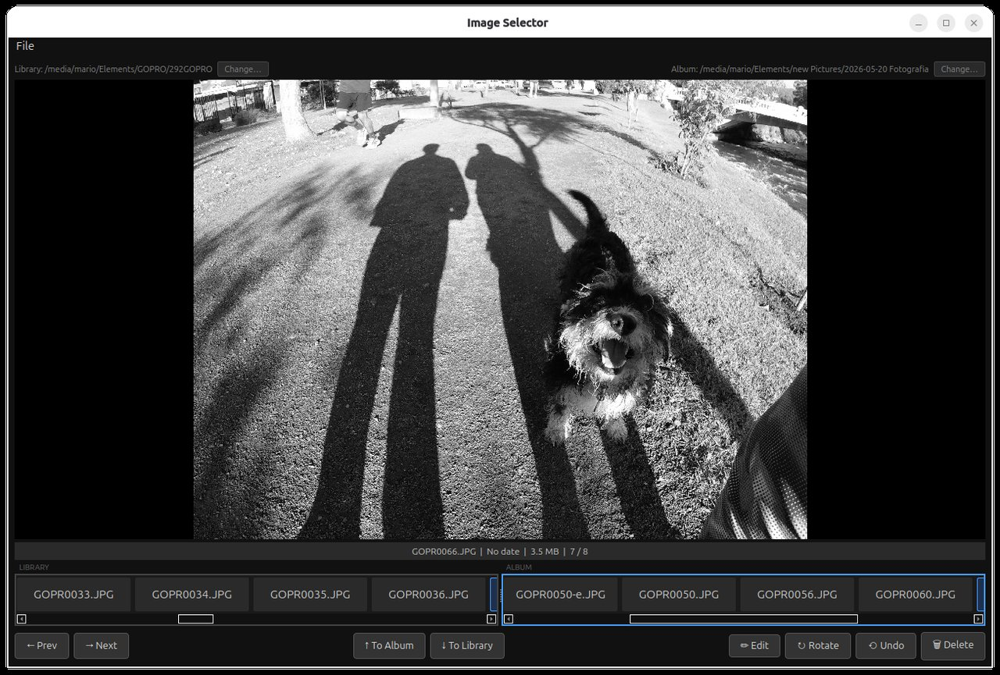
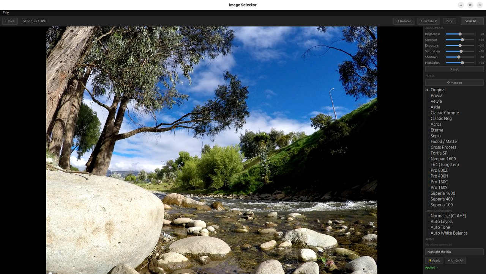

# Image Selector

A keyboard-driven desktop tool for triaging and organizing photos. Load a source library and an album folder, browse images with arrow keys, and move or delete them without ever touching the mouse.



*Triage view — browse, move, and delete with the keyboard.*



*Edit mode — non-destructive adjustments, 20 film simulations, crop, and rotate.*

## Features

- Two-panel layout: **Library** (source) and **Album** (destination) shown side by side as scrollable thumbnail strips
- Large preview with **zoom** (mouse wheel, cursor-centred) and **pan** (left-drag); double-click to reset
- **Edit mode** — enter with `E`, full-screen non-destructive editor with live preview
  - Colour adjustments: Brightness, Contrast, Exposure, Saturation, Shadows, Highlights
  - **20 Fujifilm-inspired film simulations**: Provia, Velvia, Astia, Classic Chrome, Classic Neg, Acros, Eterna, Sepia, Faded/Matte, Cross Process, Fortia SP, Neopan 1600, T64, Pro 800Z, Pro 400H, Pro 160C, Pro 160S, Superia 1600, Superia 400, Superia 100
  - **Auto adjustments**: Normalize (CLAHE), Auto Levels, Auto Tone, Auto White Balance
  - **Filter visibility manager** — hide filters you never use via the ⚙ Manage button; preference is remembered between sessions
  - **AI Edit** — type a prompt ("warm cinematic look", "too dark fix it") and all sliders update automatically. Uses Claude (Anthropic API key) or a local **Ollama** vision model — no cloud account needed if Ollama is running
  - Interactive **crop tool** with aspect-ratio-locked drag handles and rule-of-thirds grid
  - Rotate left / right inside edit mode (non-destructive, applied at save time)
  - **Save As** dialog pre-filled with original filename; extension auto-inherited if omitted
  - Original file creation date always preserved on save
- Quick rotate 90° CW with `R` — saves in-place immediately
- Keyboard-first workflow — navigate, move, and delete without leaving the keyboard
- File creation dates preserved on every move and save
- Deletes go to the system trash, not permanent deletion
- Single-level undo for moves
- Lazy EXIF loading — handles large card dumps without blocking the UI
- Remembers last used folders and filter preferences between sessions

## Keyboard Shortcuts

### Triage mode

| Key | Action |
|-----|--------|
| `←` / `→` | Previous / next image in focused panel |
| `↑` | Move current image from Library → Album |
| `↓` | Move current image from Album → Library |
| `Tab` | Switch focus between Library and Album panels |
| `Del` / `Backspace` | Send current image to trash |
| `Ctrl+Z` | Undo last move |
| `E` | Open edit mode for the current image |
| `R` | Quick rotate 90° CW and save in-place |
| Mouse wheel | Zoom in / out (cursor-centred) |
| Left drag | Pan while zoomed |
| Double-click | Reset zoom |

### Edit mode

| Key | Action |
|-----|--------|
| `Ctrl+S` | Save As |
| `Esc` | Back to triage (discard edits) |
| `Enter` | Confirm crop (when crop tool is active) |
| `Esc` | Cancel crop (when crop tool is active) |

## Installation

```bash
git clone https://github.com/mnavas/image-selector.git
cd image-selector
python3 -m venv .venv
source .venv/bin/activate        # Windows: .venv\Scripts\activate
pip install -r requirements.txt
python main.py
```

For platform-specific system dependencies, desktop launcher setup, and Windows / macOS notes see **[docs/installation.md](docs/installation.md)**.

## Project Structure

```
image_selector/
├── main.py                  # Entry point
├── app_controller.py        # Action logic and UI coordination
├── config.py                # JSON config (~/.config/image_selector/)
├── image_collection.py      # Folder scanner and image list model
├── file_ops.py              # Move, trash, undo with timestamp preservation
├── thumbnail_cache.py       # LRU OpenCV thumbnail cache
├── edit_ops.py              # Pure OpenCV image editing functions + EditState
├── film_luts.py             # Fujifilm-inspired film simulation functions
├── ai_edit.py               # AI edit helpers — encoding, API calls, response parsing
├── mcp_server.py            # MCP server for Claude Code integration
├── widgets/
│   ├── main_window.py       # Main window, keyboard handling, menus
│   ├── preview_widget.py    # Zoomable/pannable image preview (QPainter)
│   ├── edit_panel.py        # Full-screen edit mode overlay
│   ├── thumbnail_strip.py   # Scrollable filename-strip
│   └── info_bar.py          # Filename / date / size / position bar
├── requirements.txt
└── docs/
    ├── installation.md
    ├── user-guide.md
    ├── architecture.md
    └── versioning/
        ├── v0.0.1/
        ├── v0.0.2/
        └── v0.0.3/
```

## Roadmap

- HEIC support (`pillow-heif`), RAW support (`rawpy`), batch editing
